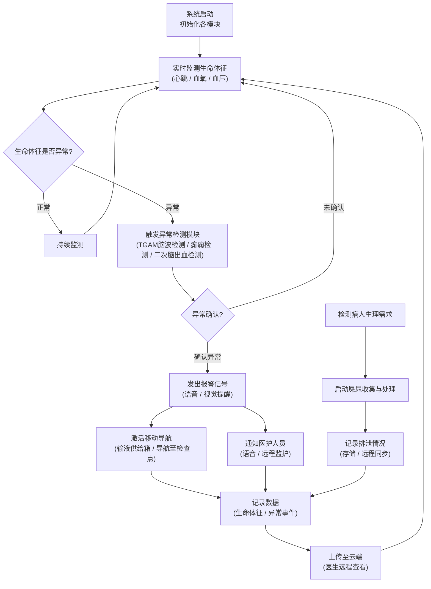

```mermaid
---
config:
  theme: default

---

flowchart TD
    A["系统启动<br/>初始化各模块"]
    B["实时监测生命体征<br/>(心跳 / 血氧 / 血压)"]
    C{"生命体征是否异常?"}
    D["持续监测"]
    E["触发异常检测模块<br/> (TGAM脑波检测 / 癫痫检测 / 二次脑出血检测)"]
    F{"异常确认?"}
    G["发出报警信号<br/> (语音 / 视觉提醒)"]
    H["激活移动导航<br/> (输液供给箱 / 导航至检查点)"]
    I["通知医护人员<br/> (语音 / 远程监护)"]
    J["记录数据<br/>(生命体征 / 异常事件)"]
    K["上传至云端<br/>(医生远程查看)"]
    X["检测病人生理需求"]
    Z["启动屎尿收集与处理<br/> "]
    W["记录排泄情况<br/>(存储 / 远程同步)"]
    A --> B
    B --> C
    C -- "正常" --> D
    D --> B
    C -- "异常" --> E
    E --> F
    F -- "未确认" --> B
    F -- "确认异常" --> G
    G --> H
    G --> I
    H --> J
    I --> J
    J --> K
    K --> B
    X --> Z
    Z --> W
    W --> J
```